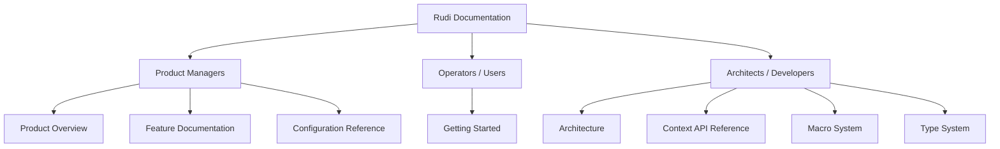

# Rudi Documentation

Rudi is an out-of-the-box dependency injection framework for Rust, providing compile-time macro generation and runtime dependency resolution with three provider scopes.

## For Product Managers

- [Product Overview](product/overview.md) -- vision, capabilities, system context, and value proposition
- Feature Documentation:
  - [Provider Scopes](product/features/scopes.md) -- Singleton, Transient, and SingleOwner lifetime models
  - [Auto-Registration](product/features/auto-registration.md) -- zero-boilerplate provider collection via inventory
  - [Module System](product/features/modules.md) -- hierarchical provider organization
  - [Async Support](product/features/async-support.md) -- async constructors and resolution
  - [Type Bindings](product/features/bindings.md) -- trait object provider registration
- [Configuration Reference](product/configuration-reference.md) -- feature flags, context options, and macro arguments

## For Operators

- [Getting Started](user/getting-started.md) -- prerequisites, installation, configuration, and first run

## For Architects and Developers

- [Architecture](technical/architecture.md) -- crate structure, C4 diagrams, component design, and key decisions
- [Context API Reference](technical/context-api.md) -- complete Context method reference with resolution, inspection, and module management
- [Macro System](technical/macro-system.md) -- attribute macros, declarative macros, and code generation
- [Type System](technical/type-system.md) -- core types, provider hierarchy, and builder functions
