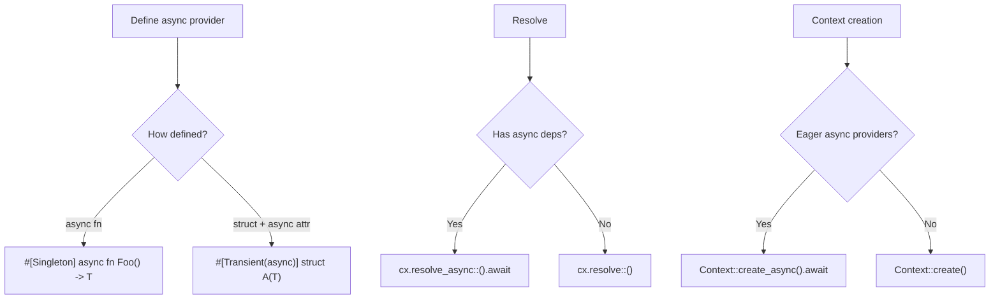

# Async Support

## Overview

Rudi supports asynchronous constructors for providers. Async providers are defined using `async fn` or the `async` attribute argument on structs and enums. Resolution of async providers uses dedicated `_async` method variants on the `Context`.

## How It Works

## Key Behaviors

- Functions declared with `async fn` automatically produce async constructors. No additional annotation is needed.
- Structs and enums use the `async` attribute argument (e.g., `#[Singleton(async)]`) to indicate that their generated constructor is async, allowing async dependency resolution for their fields.
- Calling a synchronous resolve method on a provider with an async constructor produces a `ResolveError::AsyncInSyncContext` error.
- Every synchronous `Context` method has an `_async` counterpart: `resolve_async`, `resolve_with_name_async`, `resolve_option_async`, `resolve_by_type_async`, `just_create_single_async`, `flush_async`.
- When any eager-create provider has an async constructor, `Context::create_async()` or `Context::auto_register_async()` must be used instead of the synchronous variants.
- The `Color` enum (`Async`, `Sync`) in the `Definition` tracks whether a provider's constructor is async or sync.
