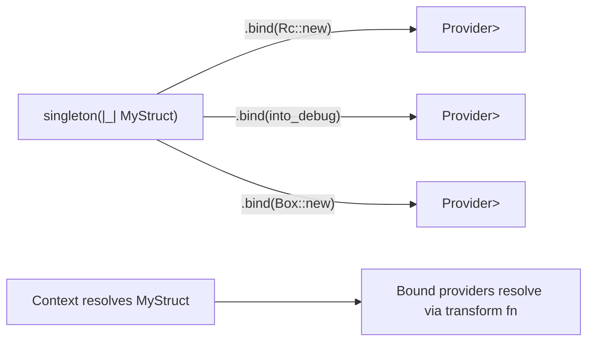

# Type Bindings

## Overview

Type bindings allow a single provider to register additional providers for derived types. When a concrete type is resolved, its bound types become independently resolvable from the context. This enables trait-object-based dependency injection patterns.

## How It Works

## Key Behaviors

- The `bind` method on provider builders (e.g., `SingletonProvider`, `TransientProvider`) accepts a transform function `fn(T) -> U` and creates a derived `Provider<U>`.
- Multiple `bind` calls can be chained on a single provider.
- Bound providers share the same name, eager_create, and condition settings as the origin provider.
- The `binds` attribute argument on macros accepts an array of function paths: `#[Singleton(binds = [Rc::new, Box::new, into_trait])]`.
- Bound providers are registered together with the origin provider when it enters the context.
- The `binding_definitions()` method on `Provider` and `DynProvider` returns metadata about all bound types.
