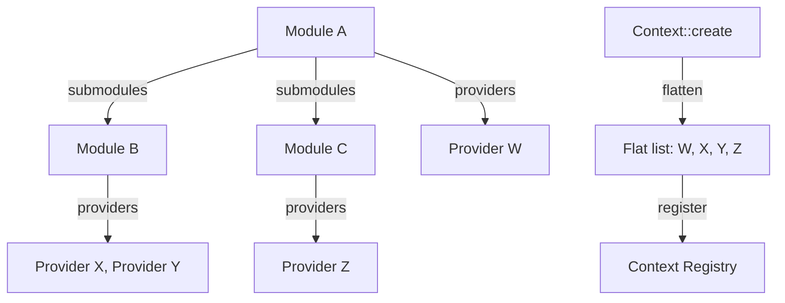

# Module System

## Overview

The module system organizes providers into logical groups. Modules implement the `Module` trait, declare their providers, and optionally include submodules. The context flattens the module hierarchy and registers all providers during creation.

## How It Works

## Key Behaviors

- A module implements the `Module` trait with a required `providers()` method returning `Vec<DynProvider>`.
- The optional `submodules()` method returns nested modules that are flattened recursively during context creation.
- The optional `eager_create()` method (default `false`) controls whether all providers in the module are eagerly instantiated.
- The `modules!` macro converts a list of `Module`-implementing types into `Vec<ResolveModule>`.
- The `components!` macro converts `DefaultProvider`-implementing types into `Vec<DynProvider>`.
- The `providers!` macro converts builder-created providers into `Vec<DynProvider>`.
- Modules can be dynamically loaded with `Context::load_modules()` and unloaded with `Context::unload_modules()` at runtime.
- `Context::flush()` evaluates conditional providers and creates eager instances after module loading.
