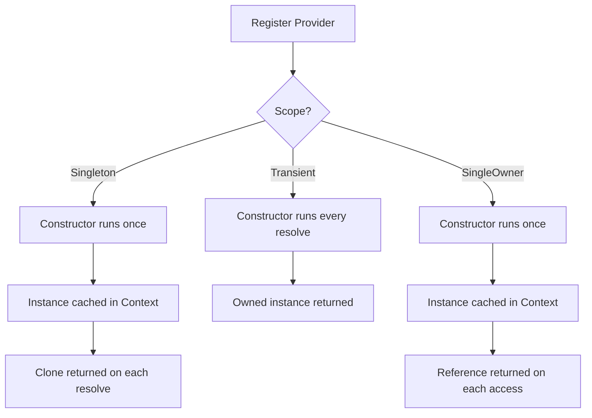

# Provider Scopes

## Overview

Rudi defines three provider scopes that control how instances are created and accessed: Singleton, Transient, and SingleOwner. Each scope determines the constructor invocation frequency and the ownership model of resolved instances.

## How It Works

## Key Behaviors

- **Singleton**: The constructor executes once. The type must implement `Clone`. Each call to `resolve` returns a cloned owned instance. References are also available via `get_single`.
- **Transient**: The constructor executes on every call to `resolve`. Each call returns a new owned instance. No caching occurs.
- **SingleOwner**: The constructor executes once. The type does not need to implement `Clone`. The instance is only accessible by reference via `get_single`. Attempting to resolve an owned instance returns an error.
- Scope is specified via the corresponding attribute macro (`#[Singleton]`, `#[Transient]`, `#[SingleOwner]`) or via the builder functions (`singleton()`, `transient()`, `single_owner()`).
- The `Scope` enum (`Singleton`, `Transient`, `SingleOwner`) is defined in `rudi-core` and re-exported from `rudi`.
