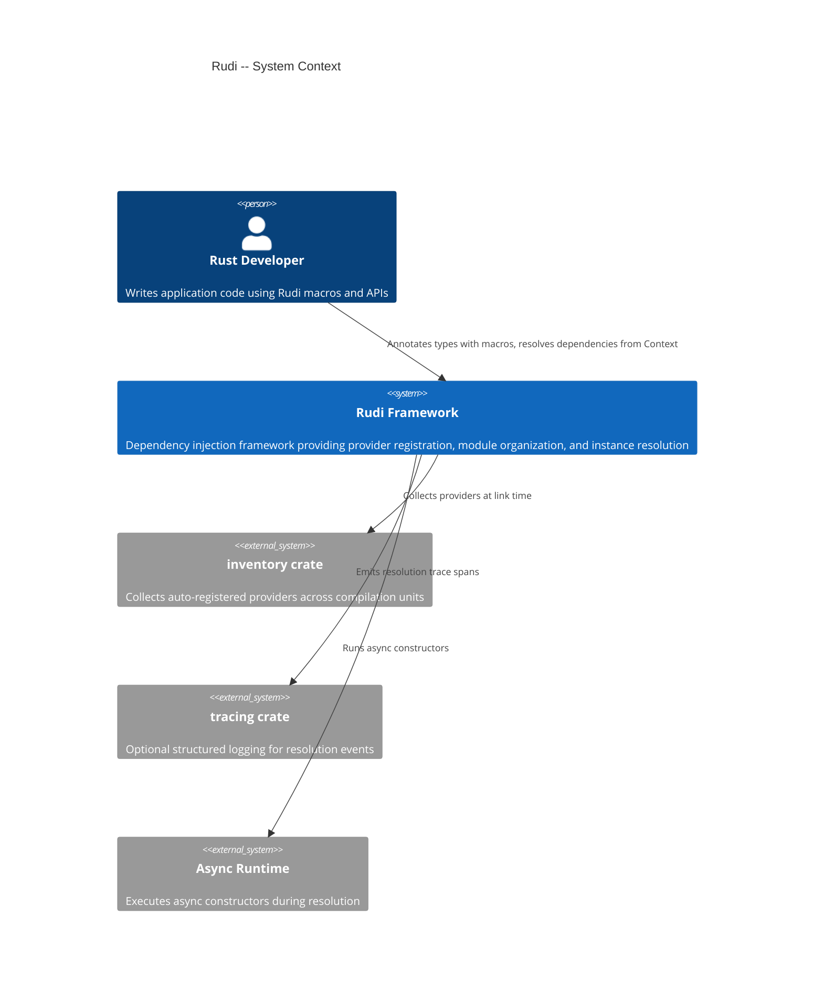

# Rudi -- Product Overview

## Vision

Rudi is an out-of-the-box dependency injection framework for Rust. It provides compile-time-safe, macro-driven dependency registration with runtime resolution, targeting Rust developers who need inversion of control in application architectures ranging from CLI tools to web servers.

## Capabilities

### Provider Registration

- Register struct, enum, function, and impl block constructors via attribute macros
- Support for three provider scopes: Singleton, Transient, and SingleOwner
- Named providers for disambiguating multiple instances of the same type
- Conditional provider registration based on runtime context evaluation

### Dependency Resolution

- Automatic constructor argument injection from the context
- Synchronous and asynchronous resolution paths
- Circular dependency detection with diagnostic error messages
- Optional and default value injection for graceful degradation

### Module System

- Group providers into reusable modules with hierarchical submodule support
- Auto-registration via the `inventory` crate for zero-boilerplate setup
- Dynamic module loading and unloading at runtime
- Cross-crate auto-registration with the `enable!` macro

### Instance Lifecycle

- Eager instance creation at context build time
- Lazy (on-demand) instance creation during resolution
- Singleton caching with reference access via `get_single`
- Provider override for testing and environment-specific configuration

### Type Binding

- Bind a concrete provider to multiple trait object types
- Chain multiple bindings on a single provider (e.g., `Rc<dyn Debug>`, `Arc<T>`, `Box<T>`)

## System Context

## Value Proposition

Rudi eliminates manual wiring of dependencies in Rust applications. Instead of threading concrete types through constructors by hand, developers annotate their types with `#[Singleton]`, `#[Transient]`, or `#[SingleOwner]` and let the framework resolve the dependency graph at runtime. This reduces coupling between components and makes it straightforward to swap implementations for testing or different deployment environments.

The three-scope model gives precise control over instance lifetimes. Singleton providers create one instance that is cloned on each resolve. SingleOwner providers create one instance that is only accessible by reference, suitable for non-Clone types. Transient providers create a fresh instance on every resolve. This covers the full spectrum of ownership patterns in Rust without requiring `Arc` or other shared-ownership wrappers at the application level.

The auto-registration feature, powered by the `inventory` crate, means that annotated types are automatically collected into the context without explicit module declarations. For larger applications, the module system provides organizational boundaries, and the conditional and eager-create mechanisms give fine-grained control over initialization order and feature toggling.

Rudi supports both synchronous and asynchronous constructors natively. Async providers integrate with any executor and are resolved with `.await` variants of the standard resolution methods. The framework detects and reports attempts to call async constructors in synchronous contexts, preventing subtle runtime errors.
