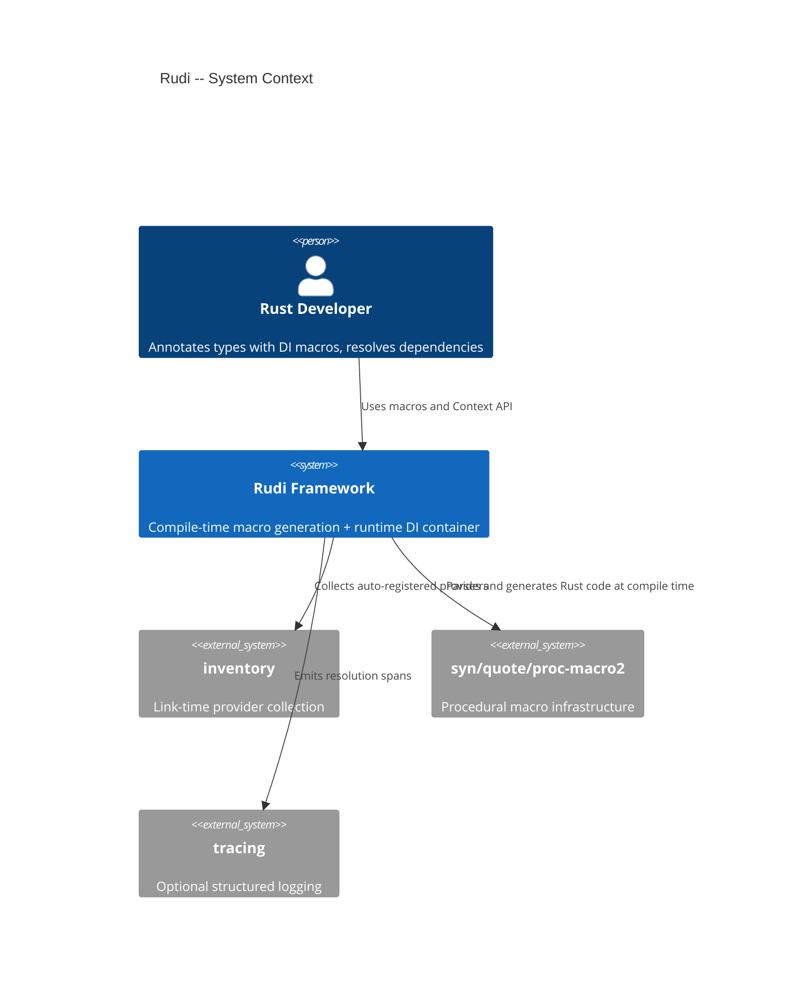
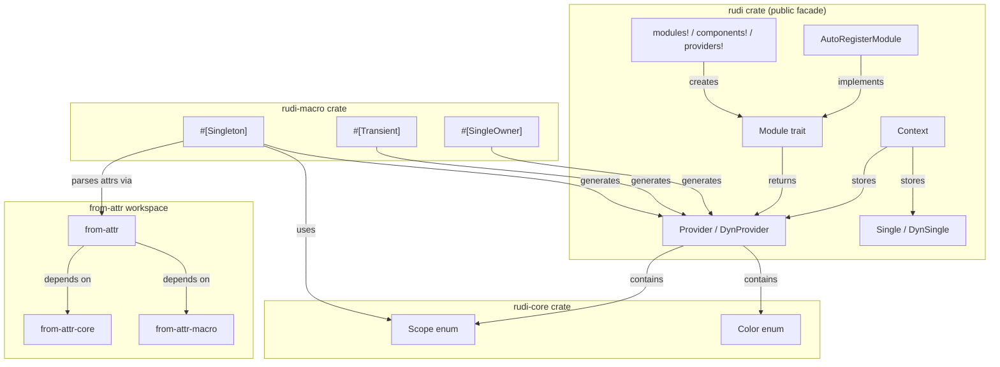
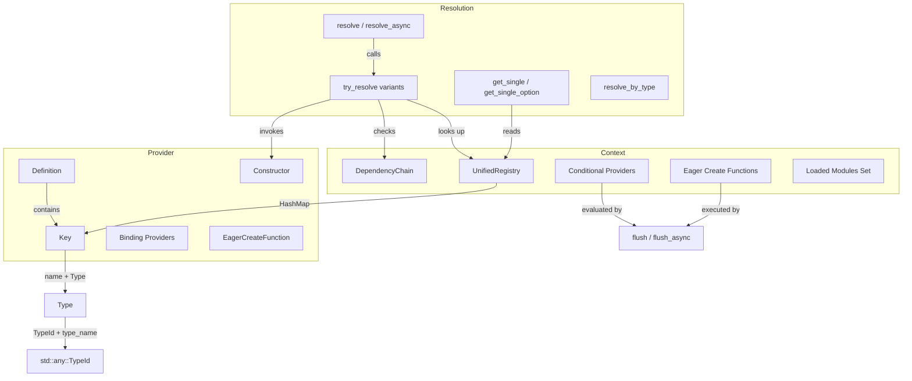

# Architecture

## Overview

Rudi is a Rust dependency injection framework organized as a Cargo workspace with three core crates (`rudi`, `rudi-core`, `rudi-macro`) and three supporting crates (`from-attr`, `from-attr-core`, `from-attr-macro`). The `rudi` crate is the public facade that re-exports types from `rudi-core` and optionally `rudi-macro`. The `Context` struct serves as the central container, managing provider registration, instance caching, and dependency resolution.

## System Context (C4 Level 1)

The developer interacts with Rudi through attribute macros at compile time and the `Context` API at runtime. The `inventory` crate enables zero-boilerplate provider collection across compilation units. The `syn` ecosystem powers the procedural macros that generate `DefaultProvider` implementations.

## Container View (C4 Level 2)

The `rudi` crate contains all runtime types: `Context`, `Provider`, `Module`, `Single`, and the helper macros. The `rudi-macro` crate contains the three attribute proc macros that generate `DefaultProvider` implementations. The `rudi-core` crate holds the `Scope` and `Color` enums shared between the runtime and macro crates. The `from-attr` workspace provides attribute parsing utilities used by `rudi-macro`.

## Component View (C4 Level 3)

The `Context` holds a `UnifiedRegistry` that maps `Key` (type + name) to `ProviderEntry` values. Each `ProviderEntry` contains a `DynProvider` and optionally a cached `DynSingle` instance. Resolution traverses the registry, invokes the constructor, detects circular dependencies via `DependencyChain`, and caches singleton results.

## Key Design Decisions

- **Three-crate split**: `rudi-core` holds shared enums so `rudi-macro` can reference `Scope` without depending on the full runtime. This avoids circular dependencies between the proc macro crate and the runtime crate.
- **Type-erased providers**: `DynProvider` erases the generic type parameter of `Provider<T>` using `Box<dyn Any>`, enabling heterogeneous storage in a single `HashMap`. The original `Provider<T>` is recoverable via `as_provider::<T>()`.
- **Unified registry**: Providers and their cached singleton instances are stored together in `ProviderEntry`, eliminating the need for separate provider and instance maps and ensuring consistency.
- **Inventory-based auto-registration**: The `inventory` crate provides a portable, linker-based mechanism for collecting providers across compilation units without requiring a central registration point.
- **Sync/async duality**: Every resolution method has both sync and async variants. The `Color` enum tracks whether a provider's constructor is async, enabling the framework to produce clear errors when async providers are called synchronously.
- **No unsafe code**: The workspace enforces `#![forbid(unsafe_code)]`, relying on `std::any::Any` downcasting instead of unsafe transmutes.
