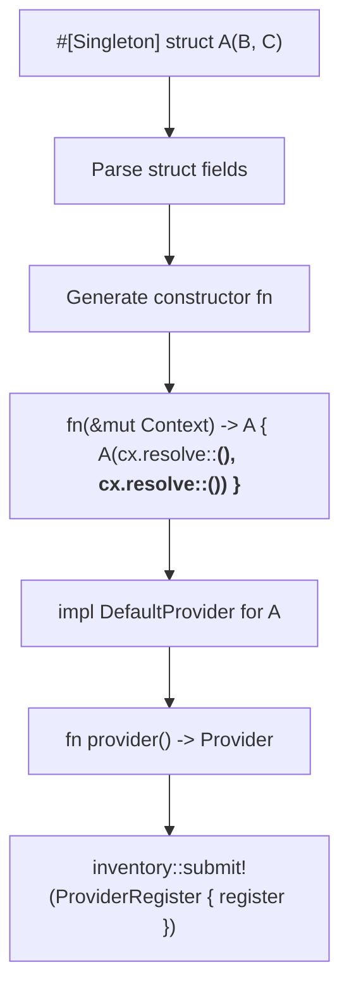

# Macro System

## Overview

The `rudi-macro` crate provides three attribute macros (`#[Singleton]`, `#[Transient]`, `#[SingleOwner]`) and the `rudi` crate provides four declarative macros (`modules!`, `components!`, `providers!`, `register_provider!`, `enable!`). Together they form the code generation layer that eliminates boilerplate in provider registration.

## Attribute Macros

### Supported Targets

The `#[Singleton]`, `#[Transient]`, and `#[SingleOwner]` macros can be applied to:

- **struct**: Generates a constructor from the struct's fields, resolving each from the context
- **enum**: Generates a constructor from the `#[di]`-annotated variant's fields
- **fn**: Creates a zero-sized struct with the function's name and generates a provider whose type is the function's return type
- **impl block**: Uses the `#[di]`-annotated method as the constructor

### Code Generation

Each macro generates a `DefaultProvider` implementation for the target type:



### The #[di] Helper Attribute

The `#[di]` attribute is used in several contexts:

- **On impl block methods**: Selects which method serves as the constructor
- **On enum variants**: Selects which variant is constructed
- **On struct fields / function arguments**: Configures how each dependency is resolved

Field/argument `#[di]` options:

- `#[di(name = "foo")]` -- resolve by name
- `#[di(option)]` -- resolve as `Option<T>`
- `#[di(default)]` or `#[di(default = expr)]` -- use a default if not found
- `#[di(vec)]` -- resolve all providers of the type as `Vec<T>`
- `#[di(ref)]` -- resolve as `&T` reference from a Singleton/SingleOwner
- `#[di(rudi_path = path)]` -- specify a custom path to the rudi crate

## Declarative Macros

### modules!

Converts types implementing `Module` into `Vec<ResolveModule>`:

```rust
let modules: Vec<ResolveModule> = modules![ModuleA, ModuleB];
```

### components!

Converts types implementing `DefaultProvider` into `Vec<DynProvider>`:

```rust
let providers: Vec<DynProvider> = components![TypeA, TypeB];
```

### providers!

Converts builder-created providers into `Vec<DynProvider>`:

```rust
let providers: Vec<DynProvider> = providers![
    singleton(|_| 42),
    transient(|cx| MyType::new(cx.resolve())),
];
```

### register_provider!

Registers a programmatically created provider for auto-registration:

```rust
fn my_provider() -> Provider<String> {
    singleton(|_| "hello".to_string()).into()
}
register_provider!(my_provider());
```

### enable!

Generates a public `enable()` function for cross-crate auto-registration:

```rust
enable! {
    other_lib::enable();
}
```
