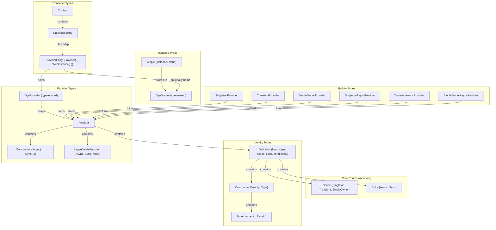

# Type System

## Overview

Rudi uses a set of core types to represent providers, instances, and their metadata. This document describes the key types, their relationships, and their roles in the dependency injection lifecycle.

## Type Hierarchy

## Key Types

### Type

Wraps `std::any::TypeId` with a human-readable `&'static str` type name. Used as part of provider identity.

### Key

Combines a `Type` with a `Cow<'static, str>` name. Two providers with the same type but different names are distinct entries in the registry.

### Definition

Full metadata for a provider: its `Key`, optional origin type (for bound providers), `Scope`, constructor `Color`, and whether it is conditional.

### Provider\<T\>

The generic provider holding a typed constructor, eager-create flag, condition function, and optional binding providers. Converted to `DynProvider` for storage in the context.

### DynProvider

Type-erased wrapper around `Provider<T>`. The original `Provider<T>` is recoverable via `as_provider::<T>()` using `Box<dyn Any>` downcasting.

### Single\<T\> / DynSingle

`Single<T>` holds a cached instance and an optional clone function. `DynSingle` type-erases it for storage. References are obtained via `as_single::<T>()`.

### ProviderEntry

A registry entry holding a `DynProvider` and optionally a `DynSingle`. The `Provider` variant indicates no cached instance; the `WithInstance` variant includes the cached singleton.

### ResolveError

Error type for fallible resolution with variants: `NoProvider`, `NotSingletonOrTransient`, `NotSingletonOrSingleOwner`, `AsyncInSyncContext`, `CircularDependency`.

### DefaultProvider Trait

Implemented by types annotated with attribute macros. Provides a `provider()` method returning the default `Provider<Self::Type>` for the type.

### Module Trait

Implemented by module types. Provides `providers()` returning `Vec<DynProvider>`, optional `submodules()` returning `Vec<ResolveModule>`, and optional `eager_create()` returning `bool`.

### ContextOptions

Builder for creating a `Context` with non-default settings. Methods: `allow_override()`, `allow_only_single_eager_create()`, `eager_create()`, then `create()`, `auto_register()`, or their async variants.

## Builder Functions

| Function | Creates | Scope |
|----------|---------|-------|
| `singleton(constructor)` | `SingletonProvider<T>` | Singleton |
| `transient(constructor)` | `TransientProvider<T>` | Transient |
| `single_owner(constructor)` | `SingleOwnerProvider<T>` | SingleOwner |
| `singleton_async(constructor)` | `SingletonAsyncProvider<T>` | Singleton |
| `transient_async(constructor)` | `TransientAsyncProvider<T>` | Transient |
| `single_owner_async(constructor)` | `SingleOwnerAsyncProvider<T>` | SingleOwner |

Each builder provides `.name()`, `.eager_create()`, `.condition()`, and `.bind()` methods before conversion to `Provider<T>` or `DynProvider` via `Into`.
